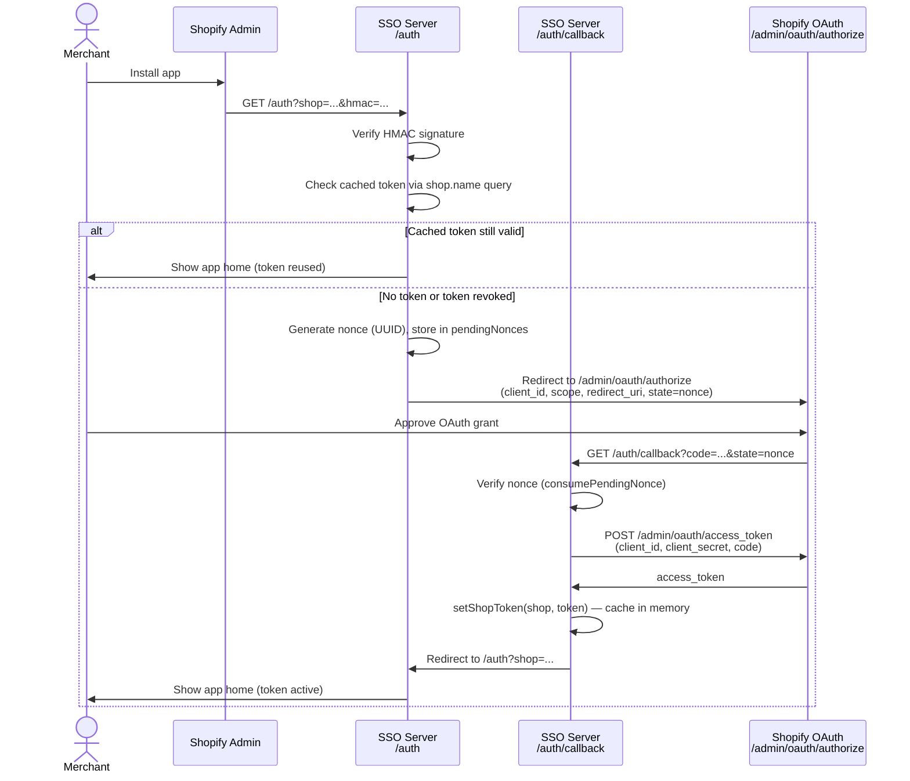
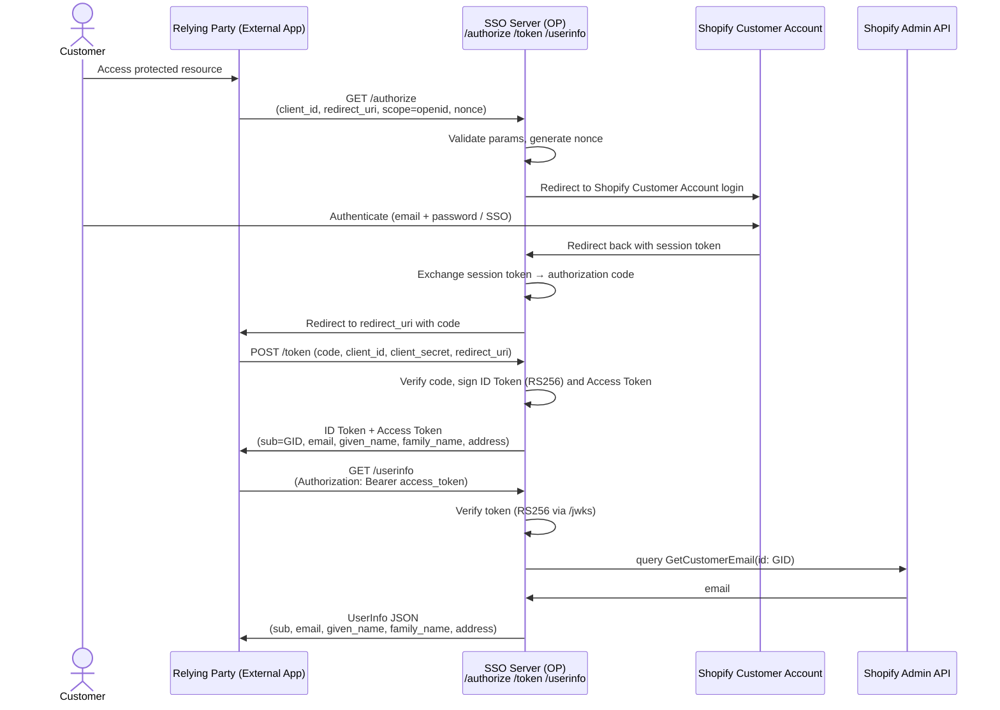
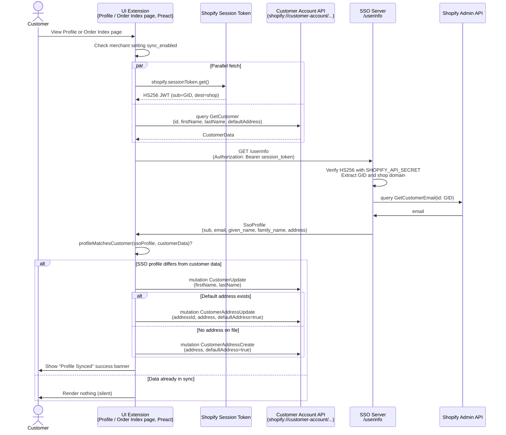
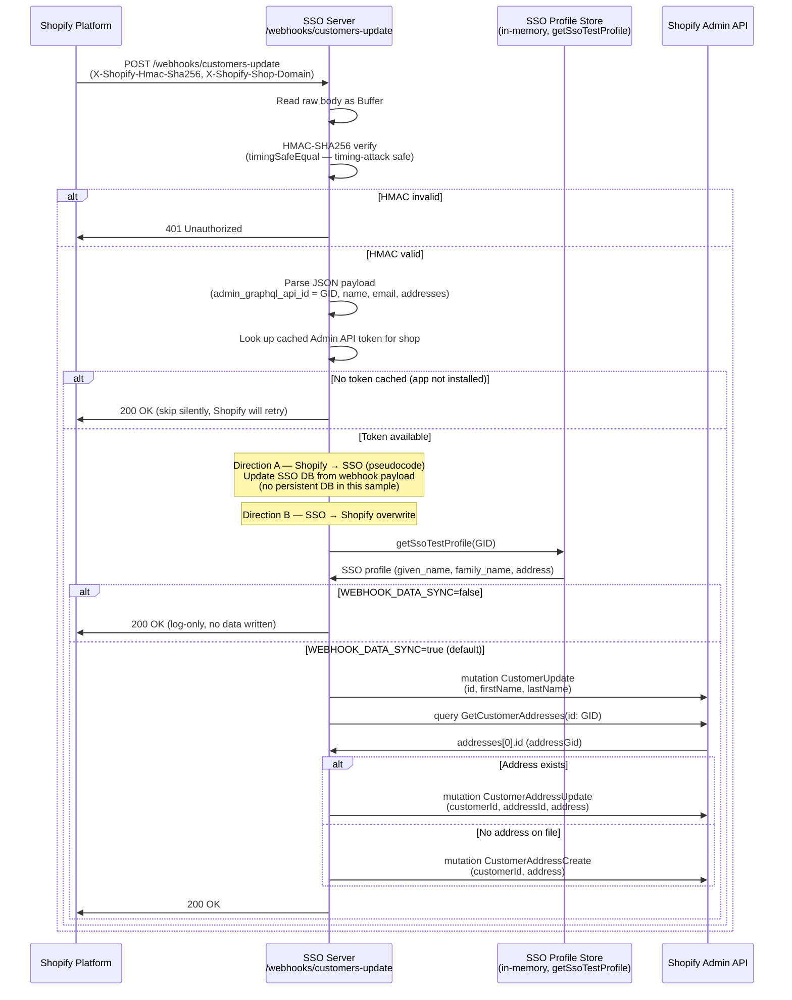

# Architecture — SSO Sample Sequence Diagrams

Four flows implemented in this sample.

---

## Flow 0 — App Installation OAuth (Admin API Token Acquisition)

The merchant installs the app via the Shopify Partner Dashboard or App Store. This flow obtains an Admin API access token and caches it server-side for subsequent Admin API calls.

**Key points:**
- HMAC on incoming request is verified with `SHOPIFY_API_SECRET` to confirm the request is from Shopify.
- Cached tokens are validated with a live `{ shop { name } }` Admin API query — a revoked token (after uninstall) triggers re-authorization automatically.
- The nonce is single-use and auto-expires after 10 minutes to prevent replay attacks.
- The access token is stored in-memory (`Map<shopDomain, token>`); it is lost on server restart and re-acquired on the next `/auth` visit.

---

## Flow 1 — OIDC Authorization Code Flow (Login → Authorize → Profile Sync)

A Relying Party (RP / external service) authenticates a customer via this SSO server acting as an OpenID Connect Provider (OP).

**Key points:**
- `/authorize` generates a nonce and redirects to Shopify Customer Account login.
- `/token` issues RS256-signed ID Token and Access Token.
- `/userinfo` accepts either HS256 session tokens or RS256 access tokens.
- Customer email is resolved via Admin API (GID → email), cached in-memory.

---

## Flow 2 — Customer Account UI Extension (userinfo → Customer Data Overwrite)

Runs on every page load (Profile page and Order Index page). Fetches the SSO profile and overwrites Shopify customer data if it differs.

**Key points:**
- Session token fetch and customer query run in parallel to minimize latency.
- `/userinfo` response embeds the Admin API query/response in `street_address` for demo visibility.
- All API calls are logged to browser DevTools console with URL, query, and response body.

---

## Flow 3 — Webhook (Shopify customers/update → SSO → Shopify Overwrite)

Triggered by Shopify when any customer record is updated. The SSO server overwrites Shopify with the canonical SSO profile (Direction B).

**Key points:**
- Raw body is read as `Buffer` before JSON parsing to compute the correct HMAC.
- `WEBHOOK_DATA_SYNC=false` disables Direction B data writes (log-only mode). Default (unset) is `true`.
- Direction A (Shopify → SSO DB) is shown as pseudocode — no persistent DB in this sample.
- Direction B (SSO → Shopify) mirrors what the UI Extension does, but server-side.
- Non-2xx responses trigger automatic Shopify webhook retry.
- `X-Shopify-Hmac-Sha256` is verified with `timingSafeEqual` to prevent timing attacks.
