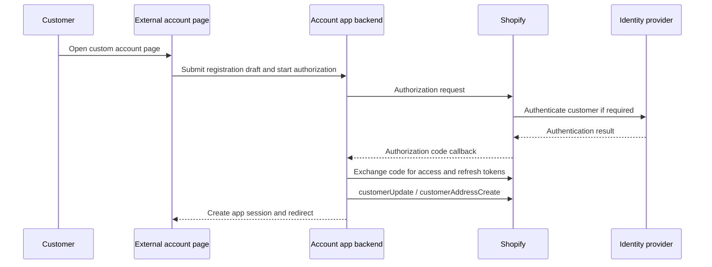
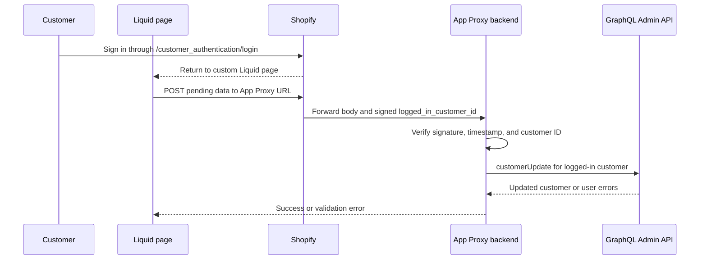

# Theme Sample — Custom Login Page for New Customer Accounts

This directory contains Liquid snippets for building a **custom login/registration page** within a Shopify theme. It demonstrates how to redirect customers into the New Customer Accounts authentication flow (`/customer_authentication/login`) with pre-filled hints, rather than using the default Shopify account page.

This is a separate topic from the OIDC provider sample in the repository root.

---

## Files

| File | Description |
|---|---|
| [header_liquid_for_custom_login_page.liquid](header_liquid_for_custom_login_page.liquid) | Header section snippet with three variants: (1) original, (2) custom login page + custom redirect, (3) standard login UI + custom redirect only |
| [custom_liquid_for_custom_login_page.liquid](custom_liquid_for_custom_login_page.liquid) | Custom Liquid block to embed in a Shopify page — renders a registration form (logged-out state) or a welcome screen (logged-in state) |

---

## How It Works

### Option A — Full custom page (variant 2 in header snippet)

```
Customer clicks account icon
        │
        ▼
/pages/custom-login-page   (theme page with Custom Liquid block)
        │
        │  [Logged in]
        ├──────────────────────────────▶ Welcome screen
        │                                (link to My Account / Logout)
        │
        │  [Not logged in]
        └──────────────────────────────▶ Registration form
                                         (Last name / First name / Email / Agree)
                                                  │
                                                  ▼
                                 /customer_authentication/login
                                   ?login_hint=<email>
                                   &login_hint_mode=submit
                                   &return_to=/pages/custom-login-page
                                          │
                                          ▼
                              New Customer Accounts login/signup flow
                                          │
                                          ▼
                               Return to /pages/custom-login-page
                                   (now shows welcome screen)
```

1. The header snippet redirects the account icon to `/pages/custom-login-page`.
2. The Custom Liquid block checks ``:
   - **Logged in**: Shows the customer's name, email, and links to their profile and logout.
   - **Not logged in**: Shows a registration form.
3. On form submit, JavaScript redirects to `/customer_authentication/login` with:
   - `login_hint` — pre-fills the email field in the New Customer Accounts flow
   - `login_hint_mode=submit` — automatically advances past the email entry step without extra user interaction
   - `return_to` — brings the customer back to `/pages/custom-login-page` after login/signup

### Option B — Redirect-only (variant 3 in header snippet)

Use this when you only need to change the post-login destination, without building a fully custom page.

```
Customer clicks account icon
        │
        ├──── [Logged in] ────▶ routes.account_url  (standard My Account)
        │
        └── [Not logged in] ──▶ /customer_authentication/login
                                  ?return_to=/pages/custom-login-page
                                          │
                                          ▼
                              New Customer Accounts login/signup flow
                                          │
                                          ▼
                               Return to /pages/custom-login-page
```

The standard New Customer Accounts login UI is used as-is; only the post-login redirect destination is customized via `return_to`.

---

## Limitations of the Registration Form

The registration form in `custom_liquid_for_custom_login_page.liquid` (last name, first name, and the terms-of-service checkbox) is **cosmetic only**. These fields are not submitted to Shopify — the form JavaScript reads the email value and passes it to `/customer_authentication/login` as `login_hint`, but the name and checkbox values are discarded after being temporarily stored in `sessionStorage`.

No event or API access token is automatically delivered to this Liquid page after login. To persist the form data, choose an explicit integration pattern. The two app-based patterns below are useful when demonstrating a custom account page that replaces or extends Shopify's standard account experience.

### Pattern 1 — Customer Account API for an external account page

Use this pattern when the account page is hosted outside the Shopify theme and needs ongoing customer-scoped access to profile, address, or order data.

For this pattern, change the account link to the external account application. The application should start the Customer Account API authorization flow when it does not already have a valid customer session. Link to an app-controlled start endpoint rather than hard-coding Shopify's authorization endpoint, because the app must perform endpoint discovery and generate per-request `state` and `nonce` values, plus PKCE values for a public client.



The app should store pending name, address, and consent data server-side under a short-lived opaque flow ID before redirecting the customer. Do not put personal data in the OAuth `state` value or query string. After the callback, use the Customer Account API access token to update only the authenticated customer's data. If the external account page continues to use the API, keep token refresh and expiry handling in the backend where possible.

**Pros**

- Provides customer-scoped access designed for an external or headless account experience.
- The access token represents the current customer, so the browser does not need to supply a Shopify customer ID.
- The same authenticated experience can support profile, address, and order features beyond the initial registration update.
- Does not consume the GraphQL Admin API's shared query-cost budget.

**Cons**

- Requires a separate OAuth 2.0 authorization-code flow, endpoint discovery, callback handling, `state` and `nonce` validation, and PKCE for public clients.
- Requires secure access-token and refresh-token lifecycle management, including expiry, refresh, logout, and error recovery.
- Adds redirects even when an existing Shopify customer session allows the visible login step to be skipped.
- Requires a strategy for carrying the pre-login registration draft across storefront, Shopify, identity-provider, and application origins.
- Remains subject to Customer Account API access requirements and service limits; it is not an unlimited alternative to the Admin API.

### Pattern 2 — App Proxy with the Admin API

Use this pattern when the custom page remains in the Shopify theme and only needs a small number of server-side operations, such as saving the registration form after login. The existing `/customer_authentication/login` link and `return_to` behavior can remain unchanged.



After the customer returns, JavaScript can read the pending values from `sessionStorage` and submit them to an App Proxy URL. Shopify adds a signed `logged_in_customer_id` parameter when the storefront customer is logged in. The app must verify the proxy signature and timestamp, reject requests with no logged-in customer, and ignore any customer ID supplied in the request body. Treat `sessionStorage` only as an untrusted user-input buffer.

**Pros**

- Keeps the current Shopify login link and avoids a second customer-facing OAuth token flow.
- Is simpler for one-time profile updates and other narrowly scoped server-side actions.
- Keeps the Admin API token on the app backend and allows centralized validation, consent recording, and retry handling.
- Can update Admin-only customer data when the app has the required scopes and protected customer data access.

**Cons**

- Requires an installed app, secure Admin API credential storage, `write_customers`, and any required protected customer data approval.
- Uses the GraphQL Admin API's calculated query-cost budget for the app-store combination. Traffic bursts can be throttled and can compete with the app's other Admin API operations, so the app needs backoff, retry, and idempotency handling.
- Grants broader administrative capability than a customer-scoped token, increasing the impact of an app-backend credential compromise.
- Requires strict authorization checks so a customer can update only the record identified by the signed `logged_in_customer_id`.
- App Proxy requests do not support application cookies, so the backend cannot depend on a normal cookie session behind the proxy.

### Which pattern fits this sample?

For a production deployment of this OIDC provider sample, **OIDC claim import is the preferred option when the identity provider is the system of record for the customer's name and address**. Save the profile in the identity provider and return the supported claims during login, with Shopify's **Sync customer data** setting enabled. This avoids an additional Customer Account API authorization flow or an Admin API write after login.

For a demonstration whose goal is to replace Shopify's standard account page with an externally hosted account experience, **Pattern 1 is the better architectural example**. It gives the external page a customer-scoped API session and supports a complete account experience. Pattern 2 is a simpler alternative when the page remains in the theme and only needs a few controlled updates.

Terms acceptance should be stored with its version and timestamp in an appropriate application record or approved Shopify data model. A checkbox value in `sessionStorage` is not a durable consent record.

These theme snippets do not implement any of these persistence patterns. They demonstrate only the theme-side redirect and pre-fill mechanism.

---

## Setup in Shopify Admin

### 1. Create the page

1. In Shopify Admin → **Online Store → Pages**, create a new page.
2. Set the handle to `custom-login-page`.
3. In the page editor, add a **Custom Liquid** section and paste the contents of `custom_liquid_for_custom_login_page.liquid`.

### 2. Update the Header section

1. In **Online Store → Themes → Customize**, open the **Header** section code.
2. Find the account icon anchor tag and replace it with one of the three variants in `header_liquid_for_custom_login_page.liquid`:

   | Variant | Pattern | When to use |
   |---|---|---|
   | 1 — Original (commented out) | — | Baseline / rollback reference |
   | 2 — Custom login page + custom redirect | Replaces both the login UI and the post-login destination | Use with `custom_liquid_for_custom_login_page.liquid` (Option A) |
   | 3 — Standard login + custom redirect (commented out) | Keeps the standard New Customer Accounts login UI, changes only the post-login destination | Minimal change when you only need to control where customers land after login (Option B) |

---

## Prerequisites

- The store must have **New Customer Accounts** enabled.
- The `/customer_authentication/login` endpoint is only available when New Customer Accounts is active.

---

## Reference

| Topic | URL |
|---|---|
| Login with Shopify themes | https://shopify.dev/docs/storefronts/themes/login |
| Hydrogen with Account Component (BYOS) | https://shopify.dev/docs/storefronts/headless/bring-your-own-stack/hydrogen-with-account-component |
| Customer Account API authentication | https://shopify.dev/docs/api/customer/latest |
| Customer Account API `customerUpdate` | https://shopify.dev/docs/api/customer/latest/mutations/customerUpdate |
| Customer Account API `customerAddressCreate` | https://shopify.dev/docs/api/customer/latest/mutations/customerAddressCreate |
| Authenticate App Proxy requests | https://shopify.dev/docs/apps/build/online-store/app-proxies/authenticate-app-proxies |
| GraphQL Admin API `customerUpdate` | https://shopify.dev/docs/api/admin-graphql/latest/mutations/customerUpdate |
| Shopify API rate limits | https://shopify.dev/docs/api/usage/limits#rate-limits |
| OIDC customer authentication and claim import | https://shopify.dev/docs/api/customer-authentication |
