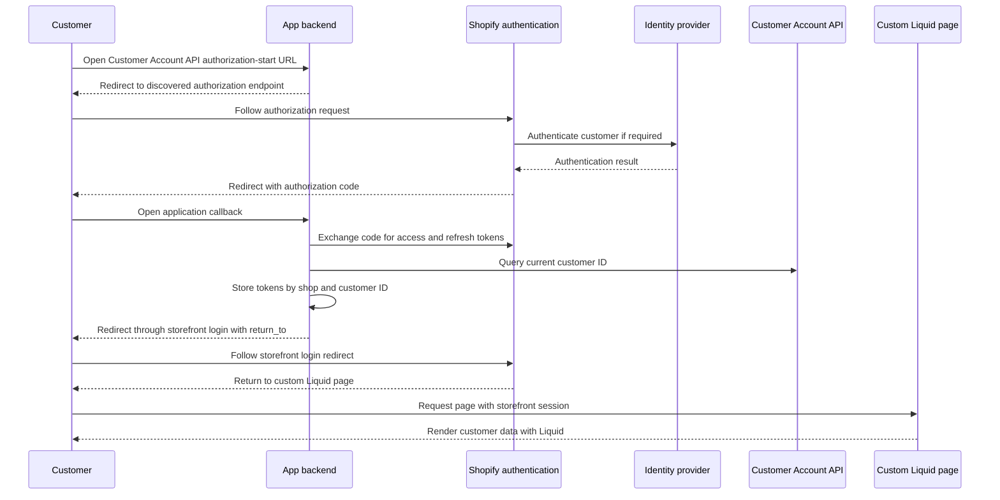
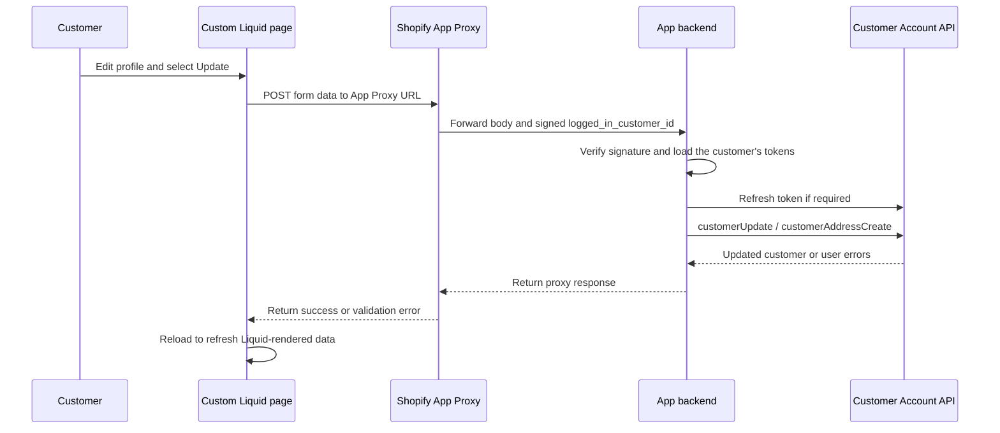
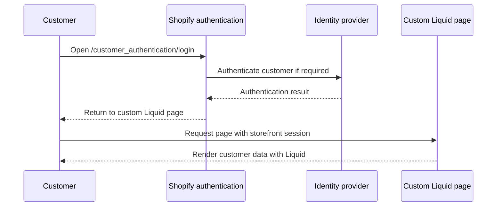
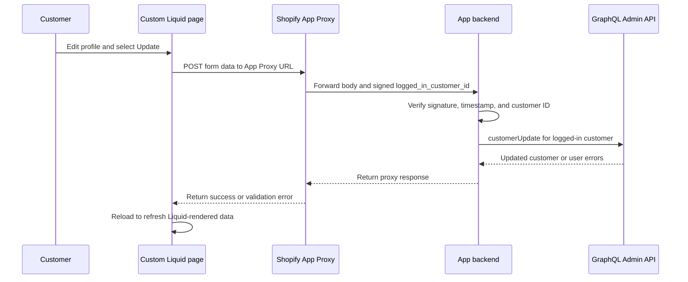

# Theme Sample — Custom Login Page for New Customer Accounts

This directory contains Liquid snippets for building a **custom login/registration page** within a Shopify theme. It demonstrates how to redirect customers into the New Customer Accounts authentication flow (`/customer_authentication/login`) with pre-filled hints, rather than using the default Shopify account page.

This is a separate topic from the OIDC provider sample in the repository root.

---

## Files

| File | Description |
|---|---|
| [header_liquid_for_custom_login_page.liquid](header_liquid_for_custom_login_page.liquid) | Header section snippet with three variants: (1) original, (2) custom login page + custom redirect, (3) standard login UI + custom redirect only |
| [custom_liquid_for_custom_login_page.liquid](custom_liquid_for_custom_login_page.liquid) | Custom Liquid block to embed in a Shopify page — renders a registration form (logged-out state) or a welcome screen (logged-in state) |

---

## How It Works

### Option A — Full custom page (variant 2 in header snippet)

```
Customer clicks account icon
        │
        ▼
/pages/custom-login-page   (theme page with Custom Liquid block)
        │
        │  [Logged in]
        ├──────────────────────────────▶ Welcome screen
        │                                (link to My Account / Logout)
        │
        │  [Not logged in]
        └──────────────────────────────▶ Registration form
                                         (Last name / First name / Email / Agree)
                                                  │
                                                  ▼
                                 /customer_authentication/login
                                   ?login_hint=<email>
                                   &login_hint_mode=submit
                                   &return_to=/pages/custom-login-page
                                          │
                                          ▼
                              New Customer Accounts login/signup flow
                                          │
                                          ▼
                               Return to /pages/custom-login-page
                                   (now shows welcome screen)
```

1. The header snippet redirects the account icon to `/pages/custom-login-page`.
2. The Custom Liquid block checks ``:
   - **Logged in**: Shows the customer's name, email, and links to their profile and logout.
   - **Not logged in**: Shows a registration form.
3. On form submit, JavaScript redirects to `/customer_authentication/login` with:
   - `login_hint` — pre-fills the email field in the New Customer Accounts flow
   - `login_hint_mode=submit` — automatically advances past the email entry step without extra user interaction
   - `return_to` — brings the customer back to `/pages/custom-login-page` after login/signup

### Option B — Redirect-only (variant 3 in header snippet)

Use this when you only need to change the post-login destination, without building a fully custom page.

```
Customer clicks account icon
        │
        ├──── [Logged in] ────▶ routes.account_url  (standard My Account)
        │
        └── [Not logged in] ──▶ /customer_authentication/login
                                  ?return_to=/pages/custom-login-page
                                          │
                                          ▼
                              New Customer Accounts login/signup flow
                                          │
                                          ▼
                               Return to /pages/custom-login-page
```

The standard New Customer Accounts login UI is used as-is; only the post-login redirect destination is customized via `return_to`.

---

## Limitations of the Registration Form

The registration form in `custom_liquid_for_custom_login_page.liquid` (last name, first name, and the terms-of-service checkbox) is **cosmetic only**. These fields are not submitted to Shopify — the form JavaScript reads the email value and passes it to `/customer_authentication/login` as `login_hint`, but the name and checkbox values are discarded after being temporarily stored in `sessionStorage`.

No event or API access token is automatically delivered to this Liquid page after login. To persist the form data, choose an explicit integration pattern. The two app-based patterns below are useful when demonstrating a custom account page that replaces or extends Shopify's standard account experience.

### Pattern 1 — Customer Account API with the same Liquid page

Use this pattern when the account experience remains on `/pages/custom-login-page`, but profile updates should use a customer-scoped Customer Account API token instead of an Admin API token.

Change the account link to an app-controlled Customer Account API authorization-start endpoint. Do not hard-code Shopify's authorization endpoint in Liquid, because the app must perform endpoint discovery and generate per-request `state` and `nonce` values, plus PKCE values for a public client. Shopify still provides the hosted customer login experience and delegates authentication to the configured identity provider when required.

#### Login and initial page render



The final redirect should pass through the storefront login route, for example `/customer_authentication/login?return_to=/pages/custom-login-page`, before returning to the Liquid page. The hosted customer session should normally let Shopify reuse the completed authentication without asking for credentials again. This explicitly establishes the storefront session required by Liquid's `customer` object; do not assume that returning directly from the app callback to the page will always populate that object without testing the complete store configuration.

The app should query the current customer through the Customer Account API after token exchange and store the access and refresh tokens server-side under the shop and customer ID. This mapping lets a later signed App Proxy request select the correct token without exposing it to Liquid or browser JavaScript.

#### Update after the customer submits the Liquid form



An HTTP-only cookie cannot be read by JavaScript; that is its security purpose. The HTTP-only cookie pattern in Shopify's headless examples works because the page and backend belong to the same application origin. In this theme pattern, the Liquid page and app callback normally use different origins, cross-site cookie delivery is not reliable, and App Proxy strips `Cookie` and `Set-Cookie` headers. Use the signed `logged_in_customer_id` from App Proxy to locate the server-side token instead. A same-site first-party app domain can support a cookie-based BFF, but that should be treated as a merchant-specific deployment option rather than the portable sample design.

Choose one of two token-handling models; do not combine them:

- **Server-side BFF (shown above):** The app keeps the Customer Account API tokens and the Liquid page calls the App Proxy. Browser JavaScript never receives the access token.
- **Public browser client:** Register the storefront as an allowed JavaScript origin, use Authorization Code + PKCE in the browser, and let JavaScript hold the Customer Account API token and call the Customer Account API endpoint directly. This makes an HTTP-only server session impossible for that token and increases the impact of theme JavaScript or XSS vulnerabilities.

**Pros**

- Keeps the presentation in the same Liquid page while using customer-scoped authorization for updates.
- The Customer Account API token is bound to the current customer and does not grant broad Admin API access.
- Does not consume the GraphQL Admin API's shared query-cost budget.
- Can be extended to customer-scoped profile, address, and order operations.

**Cons**

- Requires OAuth endpoint discovery, callback handling, token exchange, token refresh, logout, expiry handling, and secure token storage for each customer.
- Requires an explicit mapping between the Customer Account API identity and the signed storefront `logged_in_customer_id`.
- Uses an additional storefront-login bridge to ensure the Liquid `customer` session is available.
- Still needs an App Proxy or another trustworthy BFF channel for updates when tokens remain server-side.
- Remains subject to Customer Account API access requirements and service limits.

### Pattern 2 — App Proxy with the Admin API

Use this pattern when the same Liquid page needs only a small number of controlled updates and the app can hold an Admin API token. The existing `/customer_authentication/login` link and `return_to` behavior remain unchanged.

#### Login and initial page render



#### Update after the customer submits the Liquid form



Shopify adds a signed `logged_in_customer_id` parameter when the storefront customer is logged in. The app must verify the proxy signature and timestamp, reject requests with no logged-in customer, and ignore any customer ID supplied in the request body. Treat all browser-submitted values as untrusted input.

**Pros**

- Keeps the current Shopify login link and requires no separate Customer Account API OAuth flow.
- Is simpler for one-time profile updates and other narrowly scoped server-side actions.
- Needs one app-level Admin API credential instead of storing and refreshing a token for every customer.
- Can update Admin-only customer data when the app has the required scopes and protected customer data access.

**Cons**

- Requires secure Admin API credential storage, the required customer scopes such as `read_customers` and `write_customers`, and any required protected customer data approval.
- Uses the GraphQL Admin API's calculated query-cost budget for the app-store combination. Traffic bursts can be throttled and can compete with the app's other Admin API operations, so the app needs backoff, retry, and idempotency handling.
- Grants broader administrative capability than a customer-scoped token, increasing the impact of an app-backend credential compromise.
- Requires strict authorization checks so a customer can update only the record identified by the signed `logged_in_customer_id`.
- App Proxy strips application cookies, so identity must come from verified proxy parameters rather than a proxy cookie session.

### Do not mix Customer Account API and Storefront API tokens

The proposed `public Storefront API token + Customer Account API access token` request is not a valid authentication combination:

- Customer Account API profile operations must be sent to the discovered **Customer Account API GraphQL endpoint** with the Customer Account API OAuth access token.
- In the Headless channel, distinguish the Customer Account API **client ID** used in the OAuth request from a Storefront API public access token. They are separate credentials for separate APIs.
- A Storefront API public access token is sent as `X-Shopify-Storefront-Access-Token` and authorizes access to the Storefront API. It does not convert a Customer Account API token into a Storefront API customer token.
- Storefront API customer mutations use a separate Storefront `CustomerAccessToken` from the legacy customer-token flow. It is not interchangeable with a Customer Account API OAuth token and should not be introduced for a New Customer Accounts implementation.
- A public Storefront API token can be exposed to browser JavaScript when the page separately needs Storefront API product, collection, or cart data. It is not needed for the profile update flows documented here, so storing it in a shop metafield adds configuration without solving customer authentication.

### Which pattern fits this sample?

For a production deployment of this OIDC provider sample, **OIDC claim import is the preferred option when the identity provider is the system of record for the customer's name and address**. Save the profile in the identity provider and return the supported claims during login, with Shopify's **Sync customer data** setting enabled. This avoids an additional Customer Account API authorization flow or an Admin API write after login.

For a demonstration of a custom Liquid account page, **Pattern 1 demonstrates the customer-scoped Customer Account API architecture**, but it is materially more complex because it combines two Shopify session surfaces and per-customer token management. Pattern 2 is the simpler demonstration when the goal is only to update a few customer fields from the same Liquid page.

Terms acceptance should be stored with its version and timestamp in an appropriate application record or approved Shopify data model. A checkbox value in `sessionStorage` is not a durable consent record.

These theme snippets do not implement any of these persistence patterns. They demonstrate only the theme-side redirect and pre-fill mechanism.

---

## Setup in Shopify Admin

### 1. Create the page

1. In Shopify Admin → **Online Store → Pages**, create a new page.
2. Set the handle to `custom-login-page`.
3. In the page editor, add a **Custom Liquid** section and paste the contents of `custom_liquid_for_custom_login_page.liquid`.

### 2. Update the Header section

1. In **Online Store → Themes → Customize**, open the **Header** section code.
2. Find the account icon anchor tag and replace it with one of the three variants in `header_liquid_for_custom_login_page.liquid`:

   | Variant | Pattern | When to use |
   |---|---|---|
   | 1 — Original (commented out) | — | Baseline / rollback reference |
   | 2 — Custom login page + custom redirect | Replaces both the login UI and the post-login destination | Use with `custom_liquid_for_custom_login_page.liquid` (Option A) |
   | 3 — Standard login + custom redirect (commented out) | Keeps the standard New Customer Accounts login UI, changes only the post-login destination | Minimal change when you only need to control where customers land after login (Option B) |

---

## Prerequisites

- The store must have **New Customer Accounts** enabled.
- The `/customer_authentication/login` endpoint is only available when New Customer Accounts is active.

---

## Reference

| Topic | URL |
|---|---|
| Login with Shopify themes | https://shopify.dev/docs/storefronts/themes/login |
| Hydrogen with Account Component (BYOS) | https://shopify.dev/docs/storefronts/headless/bring-your-own-stack/hydrogen-with-account-component |
| Customer Account API authentication | https://shopify.dev/docs/api/customer/latest |
| Authenticate customers with the Customer Account API | https://shopify.dev/docs/storefronts/headless/building-with-the-customer-account-api/authenticate-customers |
| Customer Account API `customerUpdate` | https://shopify.dev/docs/api/customer/latest/mutations/customerUpdate |
| Customer Account API `customerAddressCreate` | https://shopify.dev/docs/api/customer/latest/mutations/customerAddressCreate |
| Storefront API authentication | https://shopify.dev/docs/api/storefront/latest |
| Authenticate App Proxy requests | https://shopify.dev/docs/apps/build/online-store/app-proxies/authenticate-app-proxies |
| GraphQL Admin API `customerUpdate` | https://shopify.dev/docs/api/admin-graphql/latest/mutations/customerUpdate |
| Shopify API rate limits | https://shopify.dev/docs/api/usage/limits#rate-limits |
| OIDC customer authentication and claim import | https://shopify.dev/docs/api/customer-authentication |
