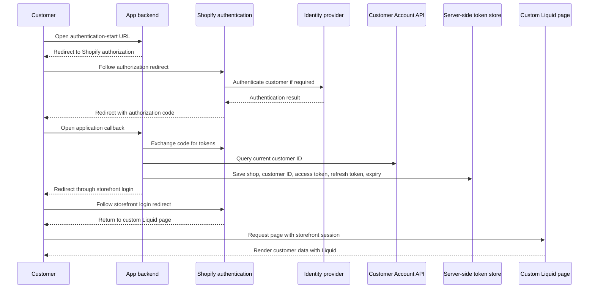
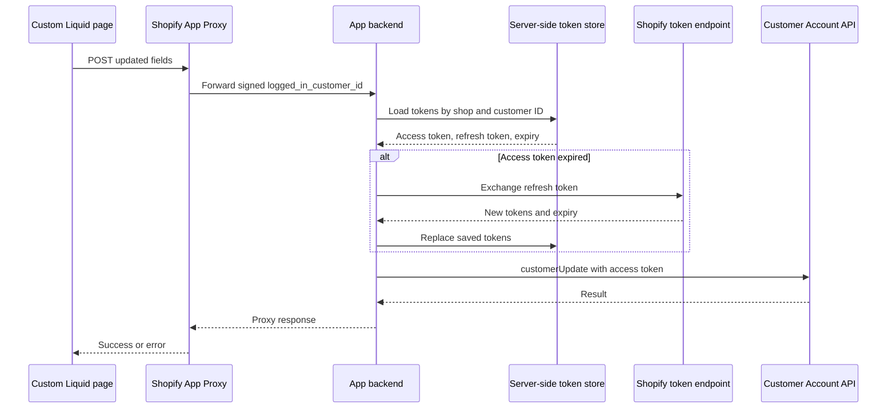
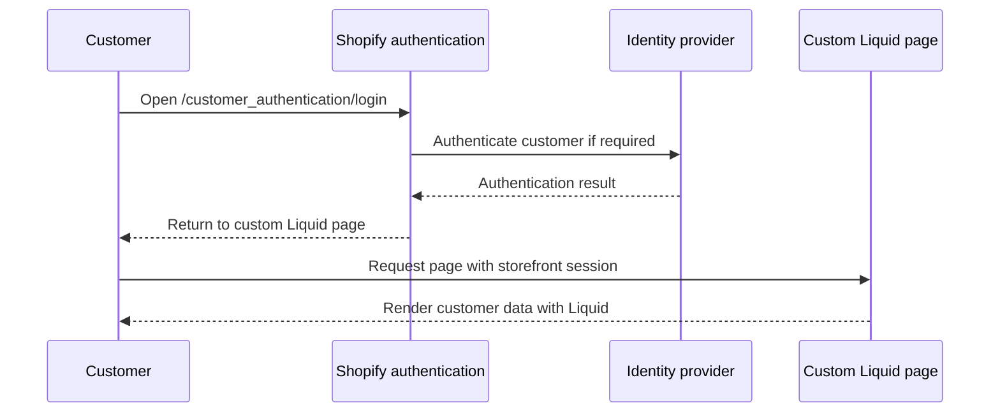
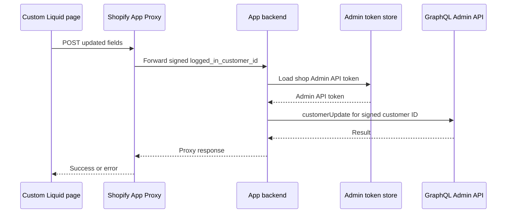

# Theme Sample — Custom Login Page for New Customer Accounts

This directory contains Liquid snippets for building a **custom login/registration page** within a Shopify theme. It demonstrates how to redirect customers into the New Customer Accounts authentication flow (`/customer_authentication/login`) with pre-filled hints, rather than using the default Shopify account page.

This is a separate topic from the OIDC provider sample in the repository root.

---

## Files

| File | Description |
|---|---|
| [header_liquid_for_custom_login_page.liquid](header_liquid_for_custom_login_page.liquid) | Header section snippet with three variants: (1) original, (2) custom login page + custom redirect, (3) standard login UI + custom redirect only |
| [custom_liquid_for_custom_login_page.liquid](custom_liquid_for_custom_login_page.liquid) | Custom Liquid block to embed in a Shopify page — renders a registration form (logged-out state) or a welcome screen (logged-in state) |

---

## How It Works

### Option A — Full custom page (variant 2 in header snippet)

```
Customer clicks account icon
        │
        ▼
/pages/custom-login-page   (theme page with Custom Liquid block)
        │
        │  [Logged in]
        ├──────────────────────────────▶ Welcome screen
        │                                (link to My Account / Logout)
        │
        │  [Not logged in]
        └──────────────────────────────▶ Registration form
                                         (Last name / First name / Email / Agree)
                                                  │
                                                  ▼
                                 /customer_authentication/login
                                   ?login_hint=<email>
                                   &login_hint_mode=submit
                                   &return_to=/pages/custom-login-page
                                          │
                                          ▼
                              New Customer Accounts login/signup flow
                                          │
                                          ▼
                               Return to /pages/custom-login-page
                                   (now shows welcome screen)
```

1. The header snippet redirects the account icon to `/pages/custom-login-page`.
2. The Custom Liquid block checks ``:
   - **Logged in**: Shows the customer's name, email, and links to their profile and logout.
   - **Not logged in**: Shows a registration form.
3. On form submit, JavaScript redirects to `/customer_authentication/login` with:
   - `login_hint` — pre-fills the email field in the New Customer Accounts flow
   - `login_hint_mode=submit` — automatically advances past the email entry step without extra user interaction
   - `return_to` — brings the customer back to `/pages/custom-login-page` after login/signup

### Option B — Redirect-only (variant 3 in header snippet)

Use this when you only need to change the post-login destination, without building a fully custom page.

```
Customer clicks account icon
        │
        ├──── [Logged in] ────▶ routes.account_url  (standard My Account)
        │
        └── [Not logged in] ──▶ /customer_authentication/login
                                  ?return_to=/pages/custom-login-page
                                          │
                                          ▼
                              New Customer Accounts login/signup flow
                                          │
                                          ▼
                               Return to /pages/custom-login-page
```

The standard New Customer Accounts login UI is used as-is; only the post-login redirect destination is customized via `return_to`.

---

## Updating Customer Data from the Custom Liquid Page

The current form only redirects customers to login. It does not save the name or terms acceptance.

Both patterns below keep `/pages/custom-login-page` and send update requests through [App Proxy](https://shopify.dev/docs/apps/build/online-store/app-proxies). The proxy provides a same-origin URL and a signed `logged_in_customer_id`. The main difference is the API and token used by the app.

Customer Account API does not require App Proxy by itself. This design uses it so the app can keep customer tokens server-side and avoid a separate browser CORS integration.

| | Customer Account API | Admin API |
|---|---|---|
| Login link | App-managed Customer Account API authentication | `/customer_authentication/login` |
| Saved token | Access + refresh token per customer | Admin API token per shop |
| Update API | Customer Account API | GraphQL Admin API |
| Main trade-off | Customer-scoped but more complex | Simpler but broader access and Admin API rate limits |

### Pattern 1 — Customer Account API

#### Login and initial display



The token store can be a database or server-side cache. Tokens should be encrypted at rest and never sent to the Liquid page.

#### Update button



**Pros:** customer-scoped access, no Admin API token, and no Admin API cost budget.

**Cons:** per-customer token storage, refresh handling, and an additional OAuth flow.

### Pattern 2 — Admin API

#### Login and initial display



#### Update button



**Pros:** no per-customer token management and a simpler login flow.

**Cons:** broader Admin API access, protected customer data requirements, and possible throttling under the Admin API cost limit.

### Notes

- A Storefront API public token is not required.
- Liquid JavaScript does not read the customer tokens; the app loads them from its token store.
- OIDC claim import remains preferable when the identity provider is the profile system of record.
- Store terms acceptance with its version and timestamp, not only in `sessionStorage`.

These theme snippets do not implement either update pattern.

---

## Setup in Shopify Admin

### 1. Create the page

1. In Shopify Admin → **Online Store → Pages**, create a new page.
2. Set the handle to `custom-login-page`.
3. In the page editor, add a **Custom Liquid** section and paste the contents of `custom_liquid_for_custom_login_page.liquid`.

### 2. Update the Header section

1. In **Online Store → Themes → Customize**, open the **Header** section code.
2. Find the account icon anchor tag and replace it with one of the three variants in `header_liquid_for_custom_login_page.liquid`:

   | Variant | Pattern | When to use |
   |---|---|---|
   | 1 — Original (commented out) | — | Baseline / rollback reference |
   | 2 — Custom login page + custom redirect | Replaces both the login UI and the post-login destination | Use with `custom_liquid_for_custom_login_page.liquid` (Option A) |
   | 3 — Standard login + custom redirect (commented out) | Keeps the standard New Customer Accounts login UI, changes only the post-login destination | Minimal change when you only need to control where customers land after login (Option B) |

---

## Prerequisites

- The store must have **New Customer Accounts** enabled.
- The `/customer_authentication/login` endpoint is only available when New Customer Accounts is active.

---

## Reference

| Topic | URL |
|---|---|
| Login with Shopify themes | https://shopify.dev/docs/storefronts/themes/login |
| Hydrogen with Account Component (BYOS) | https://shopify.dev/docs/storefronts/headless/bring-your-own-stack/hydrogen-with-account-component |
| Customer Account API authentication | https://shopify.dev/docs/api/customer/latest |
| Authenticate customers with the Customer Account API | https://shopify.dev/docs/storefronts/headless/building-with-the-customer-account-api/authenticate-customers |
| Customer Account API `customerUpdate` | https://shopify.dev/docs/api/customer/latest/mutations/customerUpdate |
| Customer Account API `customerAddressCreate` | https://shopify.dev/docs/api/customer/latest/mutations/customerAddressCreate |
| Authenticate App Proxy requests | https://shopify.dev/docs/apps/build/online-store/app-proxies/authenticate-app-proxies |
| GraphQL Admin API `customerUpdate` | https://shopify.dev/docs/api/admin-graphql/latest/mutations/customerUpdate |
| Shopify API rate limits | https://shopify.dev/docs/api/usage/limits#rate-limits |
| OIDC customer authentication and claim import | https://shopify.dev/docs/api/customer-authentication |
